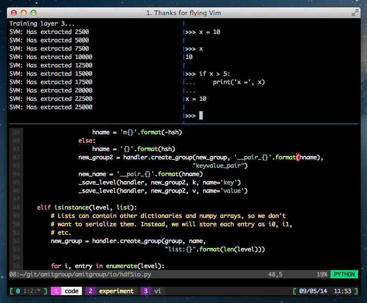
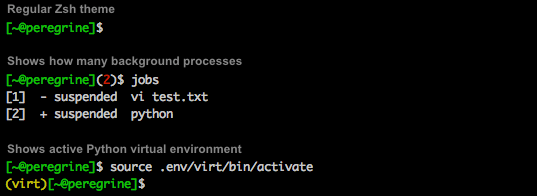

dotfiles
========

My config files for zsh, vim, tmux and IPython.

## Features

### Vim

* Syntax color theme
* Shows current language
* Shows red box as line-too-long warning in Python
* Plenty of re-mappings

### Zsh

* Prompt that shows number of background processes
* Shows active virtual environments
* Fixes Tmux colors
* More settings

### TMux

* Beautiful theme with tabs (Active tab is lit and activity gives a yellow tinge to the text)
* Configured for mouse interaction and scrolling

### IPython

* Gives a more classic Python look
